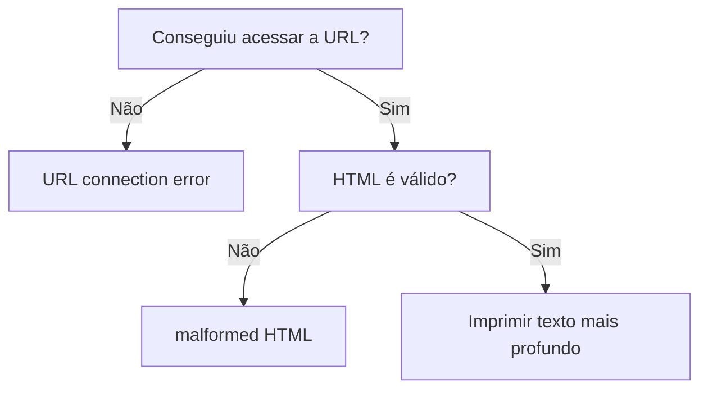
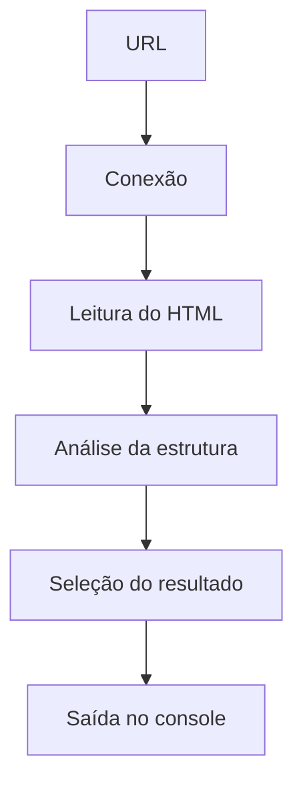

# `AXUR - Teste técnico: Software Development Intern`

## Conteúdo

 - **Teoria:**
   - [`Entendendo o problema (desafio)`](#und-challenge)
   - [`Entendendo o conceito de profundidade no HTML`](#und-depth-concept)
   - [`Entendendo a regra de desempate: o primeiro texto vence`](#und-rule)
   - [`Entendendo os outputs possíveis do programa`](#und-output)
   - [`Dividindo o problema em blocos bem definidos`](#divide-the-problem)
 - **Implementação:**
   - [`Adicionando .editorconfig e .gitignore`](#editorconfig-gitignore)
   - [`Como iniciar um projeto (vazio) com gradle`](#gradle-init)
   - [`Adicionando Linters e Formatadores de código no Java`](#lint-formatter)
<!---
[WHITESPACE RULES]
- 50
--->


---

<div id="und-challenge"></div>

## `Entendendo o problema (desafio)`

> 🧠 Pense neste desafio como um jogo de camadas.

 - O HTML é como uma cebola 🧅
 - quanto mais camadas você atravessa, **mais profundo você está**.

O objetivo do programa é:

 - Encontrar o texto que está mais “enterrado” dentro dessas camadas;
 - e retornar somente esse texto no console;
 - *Nada mais!*

> **Mas, o que significa “nível de profundidade”?**

 - Cada vez que uma **tag abre**, você desce um nível.
 - Cada vez que uma **tag fecha**, você sobe um nível.

> **NOTE:**  
> O texto “herda” o nível onde ele aparece.

**Exemplo visual simples**
```html
<div>
    <section>
        <p>
            Texto profundo
        </p>
    </section>
    Texto raso
</div>
```

**Visualmente, isso vira:**
```bash
div (1)
├── section (2)
│   └── p (3)
│       └── "Texto profundo"  ← nível 3
└── "Texto raso"              ← nível 1
```

Aqui, mesmo existindo dois textos:

 - `"Texto raso"` → Tem profundidade 1
 - `"Texto profundo"` → Tem profundidade 3

✅ **Resultado final esperado:**
```bash
Texto profundo
```

> **NOTE:**  
> O programa **ignora completamente** o texto raso.


---

<div id="und-depth-concept"></div>

## `Entendendo o conceito de profundidade no HTML`

> 📐 *Profundidade é apenas um número.*  
> Esse número representa **quantas tags estão abertas naquele momento**.

Nada mais:

 - Não envolve indentação;
 - Não envolve posição visual;
 - Não envolve “nível lógico”.

> **NOTE:**  
> 👉 *Só importa quantas tags foram abertas e ainda não fechadas.*

### `O que significa “quantidade de tags abertas”?`

Sempre que o programa encontra:

 - Uma **tag de abertura** → a profundidade **aumenta**;
 - Uma **tag de fechamento** → a profundidade **diminui**;
 - Um **texto** → ele “herda” a profundidade atual.

> **📌 Texto "não altera" a profundidade.**  
> Texto apenas observa o estado atual.

### `Exemplo visual básico`

**HTML de entrada:**
```html
<div>
    <p>
        Texto
    </p>
</div>
```

Leitura mental linha a linha:

| Linha    | Tags abertas | Profundidade |
| -------- | ------------ | ------------ |
| `<div>`  | div          | 1            |
| `<p>`    | div, p       | 2            |
| `Texto`  | div, p       | 2            |
| `</p>`   | div          | 1            |
| `</div>` | —            | 0            |

> **📌 O texto está em *profundidade 2***  
> Porque existem **duas tags abertas** no momento.

### `Profundidade NÃO é indentação`

**Este HTML:**
```html
<div>
<p>
Texto
</p>
</div>
```

**E este HTML:**
```html
<div>
        <p>
Texto
        </p>
</div>
```

Têm **exatamente a mesma profundidade**, porque:

 - Indentação é ignorada
 - Apenas as tags contam


---

<div id="und-rule"></div>

## `Entendendo a regra de desempate: o primeiro texto vence`

Quando dois textos estão no mesmo nível de profundidade, não existe nova decisão:

> **🏁 O primeiro texto encontrado é o vencedor definitivo**.  
> O programa *não reconsidera*, *não compara de novo* e *não troca*.

### `Quando essa regra entra em ação?`

A regra de desempate só é aplicada quando:

 - Dois ou mais textos têm exatamente a mesma profundidade máxima;
 - Ela **nunca** se aplica quando um texto é mais profundo que outro.

### `Exemplo visual simples`

**HTML de entrada:**
```html
<div>
    <p>
        Texto A
    </p>
    <span>
        Texto B
    </span>
</div>
```

**Visualização da estrutura:**
```bash
div (1)
├── p (2)
│   └── "Texto A"
└── span (2)
    └── "Texto B"
```

> **NOTE:**  
> 📌 Ambos estão na **profundidade 2**.


**Resultado final:**
```bash
Texto A
```

### `O que o programa NÃO deve fazer`

 - ❌ Não deve substituir o texto atual em caso de empate
 - ❌ Não deve armazenar vários textos
 - ❌ Não deve escolher o último
 - ❌ Não deve ordenar ou comparar conteúdo

> **NOTE:**  
> A decisão é **puramente temporal**.


---

<div id="und-output">

## `Entendendo os outputs possíveis do programa`

> Neste desafio, o seu programa **só pode gerar três tipos de saída** no console padrão.

### `✅ 1. Texto (caso de sucesso)`

> É o **resultado esperado quando tudo dá certo**.

 - A URL foi acessada com sucesso
 - O HTML é válido
 - Um texto foi encontrado
 - Esse texto está no maior nível de profundidade

> **NOTE:**  
> O programa imprime **apenas o texto**, sem aspas, sem prefixos.

**Exemplo visual:**
```html
<div>
    <p>
        Texto mais profundo
    </p>
</div>
```

**OUTPUT:**
```bash
Texto mais profundo
```

 - Uma única linha.
 - Nenhum outro caractere.

### `❌ 2. malformed HTML`

> Esse output indica que **a estrutura do HTML é inválida**.

Ele deve ser impresso quando, por exemplo:

 - Uma tag é fechada sem ter sido aberta;
 - Tags são fechadas fora de ordem;
 - Uma ou mais tags ficam abertas no final do arquivo.

**O texto deve ser exatamente:**
```bash
malformed HTML
```

**Exemplo visual:**
```html
<div>
    <p>
</div>
```

**OUTPUT:**
```bash
malformed HTML
```

 - Mesmo que exista texto válido antes;
 - O erro estrutural tem garantia de prioridade.

### `🌐 3. URL connection error`

> Esse output indica que o programa **não conseguiu obter o HTML**.

Causas comuns:

 - URL inválida;
 - Servidor fora do ar;
 - Timeout;
 - Falha de rede.

**O texto deve ser exatamente:**
```bash
URL connection error
```

**Exemplo visual:**
```bash
java HTMLDepthAnalyzer http://url-inexistente.com
```

**OUTPUT:**
```bash
URL connection error
```

 - Sem stacktrace
 - Sem mensagem extra
 - Sem detalhes técnicos

### Regra de prioridade entre os outputs

> 🧠 **Nem todo erro tem o mesmo peso.**

A prioridade é fixa e deve ser respeitada:

 - 1️⃣ URL connection error
 - 2️⃣ malformed HTML
 - 3️⃣ Texto (sucesso)

Ou seja:

 - Se não conseguiu acessar a URL → **pare tudo**
 - Se o HTML é inválido → **ignore qualquer texto**
 - Só imprime texto se **nenhum erro ocorreu**

### `Exemplo visual de decisão`




---

<div id="divide-the-problem"></div>

## `Dividindo o problema em blocos bem definidos`

Neste passo, vamos:

 - Separar o problema em etapas independentes;
 - Entender o papel de cada etapa;
 - Preparar a estrutura do programa para evoluir com segurança.

### `Exemplo visual: o desafio como uma linha de montagem`

Pense no programa como uma esteira industrial:



> **Cada bloco recebe algo, processa, e entrega para o próximo.**  
> Nenhum bloco “pula etapas”.

### `🔌 Conexão`

Responsável por:

 - Receber a URL;
 - Tentar acessar o conteúdo remoto;
 - Falhar imediatamente se não conseguir.

> **NOTE:**  
> 📌 Se este bloco falhar, **todo o resto é ignorado**.

## `📖 Leitura`

Responsável por:

 - Ler o HTML como texto;
 - Separar o conteúdo em linhas;
 - Ignorar espaços e linhas vazias.

> **NOTE:**  
> 📌 Aqui **não existe lógica de profundidade** ainda.

### `🧠 Análise`

Responsável por:

 - Interpretar cada linha;
 - Abrir e fechar tags;
 - Controlar profundidade;
 - Detectar HTML malformado.

> **NOTE:**  
> 📌 Este é o bloco mais complexo, mas **não decide saída**.

### `🏆 Seleção`

Responsável por:

 - Observar textos encontrados;
 - Comparar profundidades;
 - Aplicar a regra de desempate;
 - Guardar apenas o texto vencedor.

> **NOTE:**  
> 📌 Nenhuma impressão acontece aqui.

### `📤 Saída`

Responsável por:

 - Decidir **qual output imprimir**
 - Respeitar a prioridade:
   - Erro de conexão;
   - HTML malformado;
   - Texto final.
 - Omprimir **uma única linha**

> **NOTE:**  
> 📌 Nada além disso pode ser impresso.

### `Arquivo: HTMLDepthAnalyzer.java`

Este arquivo representa o **ponto de entrada do programa** e deixa explícito, em código, **onde cada bloco do problema começa e termina**.

[HTMLDepthAnalyzer.java](app/src/main/java/org/example/HTMLDepthAnalyzer.java)
```java
public final class HTMLDepthAnalyzer {

    public static void main(final String[] args) {

        /*
         * Bloco 1: Conexão
         * - Receber a URL
         * - Tentar obter o HTML
         */

        /*
         * Bloco 2: Leitura
         * - Ler o HTML linha por linha
         * - Normalizar as linhas
         */

        /*
         * Bloco 3: Análise
         * - Interpretar tags e textos
         * - Controlar profundidade
         * - Detectar HTML malformado
         */

        /*
         * Bloco 4: Seleção
         * - Comparar profundidades
         * - Aplicar regra de desempate
         * - Guardar o texto vencedor
         */

        /*
         * Bloco 5: Saída
         * - Decidir o output final
         * - Imprimir uma única linha
         */
    }
}
```


---

<div id="editorconfig-gitignore"></div>

## `Adicionando .editorconfig e .gitignore`

De início vamos adicionar os arquivos `.editorconfig` e `.gitignore` na raiz do projeto:

[.editorconfig](.editorconfig)
```conf
# top-most EditorConfig file
root = true

# Unix-style newlines with a newline ending every file
[*]
end_of_line = lf
insert_final_newline = true
charset = utf-8

# 4 space indentation
[*.{py,html, js}]
indent_style = space
indent_size = 4

# 2 space indentation
[*.{json,y{a,}ml,cwl}]
indent_style = space
indent_size = 2
```

[.gitignore](.gitignore)
```conf
É muito grande não vou exibir...
```


---

<div id="gradle-init"></div>

## `Como iniciar um projeto (vazio) com gradle`

Para iniciar a estrtura básica do nosso projeto Java vamos utilizar a ferramenta `gradle`:

```bash
gradle init
```

Agora para saber se está tudo ok vamos utilizar o comando:

```bash
gradle run
```

**OUTPUT:**  
```bash
Calculating task graph as no cached configuration is available for tasks: run

> Task :app:run
Hello World!

BUILD SUCCESSFUL in 12s
2 actionable tasks: 2 executed
Configuration cache entry stored.
```


---

<div id="lint-formatter"></div>

## `Adicionando Linters e Formatadores de código no Java`

Aqui, nós vamos configurar **linters** e **formatadores no Java**, focando em **boas práticas, estilo e erros comuns**, usando ferramentas padrão da comunidade Java e integração com o **VSCode**.

### `Instalando extensões no VSCode`

Vamos começar instalando as seguintes extensões no VSCode:

 - **Extension Pack for Java** *(obrigatória)*
   - ID: `vscjava.vscode-java-pack`
 - **Checkstyle for Java**
   - ID: `shengchen.vscode-checkstyle`
 - **Google Java Format** *(formatter)*

### `Configurando o Linter (Checkstyle)`

> Aqui nós vamos criar o arquivo `checkstyle.xml` que é o responsável por definir todas as regras de estilo, organização e boas práticas que o *Checkstyle* vai aplicar ao código Java do projeto.

**Ele funciona de forma muito parecida com o pyproject.toml no Python quando usamos o Ruff:**  
é aqui que você decide o que é permitido, o que é proibido e como o código deve se parecer.

Sempre que o Checkstyle roda (no VSCode, no terminal ou no CI), ele:

 - Analisa os arquivos `.java`
 - Aplica essas regras
 - Reporta erros e avisos quando algo foge do padrão definido

O nosso `checkstyle.xml` vai ficar da seguinte maneira:

[checkstyle.xml](checkstyle.xml)
```xml
<?xml version="1.0"?>
<!DOCTYPE module PUBLIC
    "-//Checkstyle//DTD Checkstyle Configuration 1.3//EN"
    "https://checkstyle.org/dtds/configuration_1_3.dtd">

<module name="Checker">

    <!-- Define arquivos ignorados -->
    <property name="excludes" value="**/generated/**"/>

    <module name="TreeWalker">

        <!-- Tamanho máximo da linha -->
        <module name="LineLength">
            <property name="max" value="100"/>
        </module>

        <!-- Imports organizados -->
        <module name="ImportOrder">
            <property name="ordered" value="true"/>
            <property name="separated" value="true"/>
        </module>

        <!-- Boas práticas -->
        <module name="UnusedImports"/>
        <module name="RedundantImport"/>
        <module name="AvoidStarImport"/>

        <!-- Convenções de nomes -->
        <module name="MethodName"/>
        <module name="MemberName"/>
        <module name="ClassName"/>

    </module>
</module>
```

Agora, vamos para algumas explicações:

**Cabeçalho e DTD**
```xml
<?xml version="1.0"?>
<!DOCTYPE module PUBLIC
    "-//Checkstyle//DTD Checkstyle Configuration 1.3//EN"
    "https://checkstyle.org/dtds/configuration_1_3.dtd">
```

> **O que esse bloco faz?**

 - Declara que o arquivo é um XML válido
 - Define o DTD oficial do Checkstyle
 - Permite que o Checkstyle:
   - Valide a estrutura do arquivo
   - Saiba quais módulos e propriedades são aceitos
 - *📌 Sem esse bloco, o Checkstyle não consegue interpretar corretamente o arquivo.*

**Módulo raiz — `Checker`**
```xml
<module name="Checker">

    ...

</module>
```

> **O que é o `Checker`?**

 - É o módulo raiz do Checkstyle
 - Todo arquivo de configuração sempre começa por ele
 - Ele coordena a execução de todas as regras
 - Pense nele como:
   - *“O motor principal que roda todas as verificações”.*

**Exclusão de arquivos:**
```xml
<!-- Define arquivos ignorados -->
<property name="excludes" value="**/settings/**,**/generated/**"/>
```

> **O que esse bloco faz?**

 - Diz ao Checkstyle para ignorar arquivos ou pastas
 - O padrão usa glob patterns (`**`)
 - Nesse caso:
   - Qualquer arquivo dentro de uma pasta `settings` ou `generated`
   - Não será analisado pelo Checkstyle

**Analisador de código — `TreeWalker`**
```xml
<module name="TreeWalker">

    ...

</module>
```

> **O que é o `TreeWalker`?**

 - É o módulo responsável por percorrer a *árvore sintática (AST)* do código Java
 - A maioria das regras de estilo e boas práticas vivem aqui dentro
 - **📌 Regra prática:**
   - Quase todas as regras de código Java ficam dentro do `TreeWalker`

**Regra de tamanho máximo de linha**
```xml
<module name="LineLength">
    <property name="max" value="100"/>
</module>
```

> **O que esse bloco faz?**

 - Define o tamanho máximo permitido para uma linha
 - Se uma linha *ultrapassar 100 caracteres*:
   - O Checkstyle gera um erro ou warning

**Organização de imports:**
```xml
<module name="ImportOrder">
    <property name="ordered" value="true"/>
    <property name="separated" value="true"/>
</module>
```

> **O que esse bloco faz?**

 - Garante que:
   - Os imports estejam em ordem alfabética
   - Grupos de imports sejam separados por linha em branco

**Boas práticas de imports:**
```xml
<module name="UnusedImports"/>
<module name="RedundantImport"/>
<module name="AvoidStarImport"/>
```

> **O que cada regra faz?**

 - `UnusedImports`
   - Detecta imports que não estão sendo usados
 - `RedundantImport`
   - Detecta imports desnecessários
 - `AvoidStarImport`
   - Proíbe imports do tipo:
     - `import java.util.*;`

**Convenções de nomenclatura:**
```xml
<module name="MethodName"/>
<module name="MemberName"/>
<module name="ClassName"/>
```

> **O que esse bloco faz?**

Garante que os nomes sigam o padrão Java:

 - `ClassName` → `PascalCase`
 - `methodName` → `camelCase`
 - `memberName` → `camelCase`

> **NOTE:**  
> Agora, se você quebrar alguma destas regras é só abrir o VSCode em um arquivo específico que ele vai alertar (warning) os erros.

### `Configurando o Checkstyle no VSCode`

> Agora, nós vamos configurar o arquivo `.vscode/settings.json` que vai definir configurações específicas do projeto no *VSCode*.

Tudo que está aqui:

 - Vale apenas para esse workspace
 - Garante que todo mundo do time use o mesmo comportamento
 - Evita *“funciona na minha máquina”*
 - Nesse caso, ele está sendo usado para:
   - Ativar o Checkstyle
   - Apontar o arquivo de regras
   - Configurar o formatador automático (Google Java Format)

[settings.json](.vscode/settings.json)
```json
{
    "checkstyle.configuration": "${workspaceFolder}/checkstyle.xml",
    "checkstyle.enable": true,
    "checkstyle.run": "onType",

    "java.compile.nullAnalysis.mode": "automatic",

    "editor.defaultFormatter": "wx-chevalier.google-java-format",

    "[java]": {
        "editor.formatOnSave": true
    }
}
```

 - `"checkstyle.configuration": "${workspaceFolder}/checkstyle.xml"`
   - Informa ao VSCode onde está o arquivo de regras do Checkstyle
   - `${workspaceFolder}` aponta para a raiz do projeto
   - O VSCode carrega esse arquivo e aplica exatamente as regras definidas nele
   - *📌 Sem essa configuração, o Checkstyle não sabe quais regras usar.*
 - `"checkstyle.enable": true`
   - Ativa o Checkstyle neste projeto
   - Se estiver *false*, o lint fica totalmente des*abilitado
   - *📌 É o “liga/desliga” do Checkstyle.*
 - `"checkstyle.run": "onType"`
   - Define quando o Checkstyle deve rodar:
     - `onType` → enquanto você digita
     - `onSave` → apenas ao salvar
     - `manual` → somente quando você mandar rodar
   - *📌 onType dá feedback imediato.*
 - `"java.compile.nullAnalysis.mode": "automatic"`
   - Ativa a análise estática de valores nulos do compilador Java
   - O VSCode tenta detectar:
     - Possíveis *NullPointerException*
     - Atribuições inseguras
     - Retornos que podem ser null
 - `"editor.defaultFormatter": "wx-chevalier.google-java-format"`
   - Define qual ferramenta será usada para formatar o código
   - Força o uso do Google Java Format
   - Evita conflitos com outros formatadores instalados
 - `"[java]": {"editor.formatOnSave": true}`
   - Aplica a configuração somente para arquivos `.java`
   - Sempre que você salvar um arquivo Java:
     - O VSCode formata automaticamente o código
   - *📌 Garante código sempre padronizado, sem esforço manual.*


---

<div id="define-state"></div>

## `Definindo o estado principal do algoritmo (HTMLParserState.java)`

> **🧠 Todo algoritmo que analisa algo “passo a passo” precisa de memória.**  
> Essa memória é chamada de `estado (state)`.

No nosso desafio, o programa lê o HTML **linha por linha** e precisa saber, a cada instante:

 - Quais tags estão abertas;
 - Quão profundo ele está dentro do HTML

Para isso, vamos definir **dois elementos centrais de estado**:

 - Pilha de tags;
 - Profundidade atual.

> **NOTE:**  
> Sem isso, é impossível saber **qual texto está mais profundo**.

### `O que é “estado (state)”, em termos simples?`

Imagine que você está lendo um livro e vai anotando:

 - Quantos parênteses você abriu;
 - Quais ainda não foram fechados.

O HTML funciona da mesma forma.

 - Cada `<div>` abre um nível.
 - Cada `</div>` fecha um nível.

O estado guarda essa informação **enquanto o texto é lido**.

### `Exemplo visual: HTML como camadas`

**HTML:**
```html
<body>
    <div>
        <p>Texto A</p>
    </div>
</body>
```

**Visualmente, isso vira:**
```html
<body>               ← profundidade 1
    <div>            ← profundidade 2
        <p>          ← profundidade 3
            Texto A
        </p>
    </div>
</body>
```

> **NOTE:**  
> - 📌 Quando o texto `"Texto A"` é encontrado, a profundidade atual é **3**.  
> - É exatamente esse número que queremos acompanhar.

### `Como representamos isso no código?`

> **Para representar isso em código nós utilizamos a estrutura de dados: `pilha (stack)`.**

A pilha representa:

 - Tags abertas;
 - Ordem correta de fechamento

**Funcionamento mental:**
```html
Abriu <div>   → empilha "div"
Abriu <p>     → empilha "p"
Fechou </p>   → desempilha "p"
Fechou </div> → desempilha "div"
```

> **NOTE:**  
> 📌 Se tentar fechar algo que não está no topo da pilha, o HTML é **malformado**.

### `Estado do Parser HTML (HTMLParserState)`

> Antes de um parser HTML conseguir *validar* ou in*terpretar um documento, ele precisa **saber em que ponto (estado) da estrutura ele está**.

Em HTML, as tags se comportam como uma **pilha**:

```html
<div>
    <span>
        <p>
```

 - `<div>` abre
 - depois `<span>`
 - depois `<p>`

Para fechar corretamente, a **última tag aberta deve ser a primeira a fechar**:

```html
</p>
</span>
</div>
```

> **NOTE:**  
> 📌 Esse comportamento é exatamente o conceito de **Stack (Pilha)**.

A classe `HTMLParserState` existe para:

 - Armazenar as tags abertas;
 - Controlar a **profundidade atual**;
 - Saber se ainda existem tags abertas;
 - Permitir abrir e fechar tags de forma segura.

Vamos começar adicionando os imports necessários para isso:

[HTMLParserState.java](app/src/main/java/org/example/HTMLParserState.java)
```java
package org.example;

import java.util.ArrayDeque;
import java.util.Deque;
```

 - `package org.example;`
   - Define o **namespace** da classe;
   - Organiza o código em módulos;
   - Evita conflitos de nomes entre classes.
 - `import java.util.ArrayDeque;`
   - É uma implementação concreta de Deque;
   - Usa um array interno;
   - É:
     - rápida;
     - eficiente
     - recomendada pelo Java no lugar da antiga Stack
   - *📌 Por isso usamos Deque como tipo e ArrayDeque como implementação.*
 - `import java.util.Deque;`
   - É uma interface do Java
   - Representa uma fila dupla (Double-Ended Queue)
   - Permite inserir e remover elementos:
     - Do início;
     - Ou do final.
   - 📌 Quando usada como pilha (stack), ela trabalha em padrão LIFO:
     - *Last In, First Out (Último a entrar, primeiro a sair)*

Agora, nós vamos definir nossa classe `HTMLParserState`:

[HTMLParserState.java](app/src/main/java/org/example/HTMLParserState.java)
```java
package org.example;

import java.util.ArrayDeque;
import java.util.Deque;

public final class HTMLParserState {

  ...

}
```

Agora, nós vamos criar um Array (Deque) de strings que vai armazenar as tags abertas:

[HTMLParserState.java](app/src/main/java/org/example/HTMLParserState.java)
```java
public final class HTMLParserState {

    private final Deque<String> openTagsArray;

}
```

 - `openTagsArray`
   - Armazena as **tags HTML abertas**
   - Cada `String` representa o nome de uma tag (`div`, `span`, etc.)
 - `Por que Deque<String>?`
   - Porque precisamos de:
     - `push()` → abrir tag
     - `pop()` → fechar tag
     - *Exatamente o comportamento de uma pilha (stack)*

Continuando, agora nós vamos criar um construtor para inicializar a pilha:

[HTMLParserState.java](app/src/main/java/org/example/HTMLParserState.java)
```java
public final class HTMLParserState {

    private final Deque<String> openTagsArray;

    public HTMLParserState() {
        this.openTagsArray = new ArrayDeque<>();
    }
}
```

 - `this.openTagsArray = new ArrayDeque<>();`
   - O que `new ArrayDeque<>()` faz?
     - Cria uma pilha vazia;
     - Pronta para armazenar as tags abertas.

Agora, nós vamos criar uma função chamada `openTag()` que vai pegar o nosso array `openTagsArray` e adicionar uma nova tag na pilha utilizando o método `push()` da interface `Deque`:

[HTMLParserState.java](app/src/main/java/org/example/HTMLParserState.java)
```java
public final class HTMLParserState {

    ...

    public void openTag(final String tagName) {
        this.openTagsArray.push(tagName);
    }
}
```

 - `final String tagName`
   - Nome da tag HTML (`div`, `p`, `span`)
   - `final` impede alteração do valor dentro do método
 - `push()`
   - Insere o elemento **no topo da pilha**

**Exemplo prático:**
```bash
openTag("div")
openTag("span")

Pilha:
[topo] span
        div
```

Continuando, agora nós vamos criar uma função chamada `closeTag()` que vai pegar o nosso array `openTagsArray` e remover uma nova tag da pilha utilizando o método `pop()` da interface `Deque`:

[HTMLParserState.java](app/src/main/java/org/example/HTMLParserState.java)
```java
public final class HTMLParserState {

    ...

    public String closeTag() {
        return this.openTagsArray.pop();
    }
}
```
 - `pop()`
   - Remove o elemento do topo da pilha.

**Exemplo prático:**
```bash
Antes:
[topo] span
        div

closeTag() → "span"

Depois:
[topo] div
```

> ⚠️ **Importante**  
> Se a pilha estiver vazia, `pop()` lança: `NoSuchElementException`

Agora, nós vamos criar uma função que vai retornar quantas tags estamos abertas, ou seja, o nível de profundidade do HTML:

[HTMLParserState.java](app/src/main/java/org/example/HTMLParserState.java)
```java
public final class HTMLParserState {

    ...

    public int getCurrentDepth() {
        return this.openTagsArray.size();
    }
}
```

---

 - **O que esse método faz?**
   - Retorna **quantas tags estão abertas**;
   - Representa a profundidade atual do HTML.
 - `size()`
   - Conta quantos elementos existem na coleção

**Exemplo prático:**
```bash
<div>
    <span>
        <p>

getCurrentDepth() → 3
```

Agora, nós vamos criar uma função que vai indicar se o parser ainda possui tags não fechadas:

[HTMLParserState.java](app/src/main/java/org/example/HTMLParserState.java)
```java
public boolean hasopenTagsArray() {
    return !this.openTagsArray.isEmpty();
}
```

 - **O que esse método faz?**
   - Indica se o parser ainda possui tags não fechadas
 - **Função utilizada: `isEmpty()`**
   - Verifica se a coleção (Array) está vazia:
     - `true` → se estiver vazia
     - `false` → se tiver elementos
 - **Uso do operador `!`**
   - Inverte o valor booleano
   - Retorna:
     - `true` → existem tags abertas
     - `false` → todas as tags foram fechadas

### `Código final (completo)`

No fim, nós vamos ter o seguinte código:

[HTMLParserState.java](app/src/main/java/org/example/HTMLParserState.java)
```java
package org.example;

import java.util.ArrayDeque;
import java.util.Deque;

public final class HTMLParserState {

    private final Deque<String> openTagsArray;

    public HTMLParserState() {
        this.openTagsArray = new ArrayDeque<>();
    }

    public void openTag(final String tagName) {
        this.openTagsArray.push(tagName);
    }

    public String closeTag() {
        return this.openTagsArray.pop();
    }

    public int getCurrentDepth() {
        return this.openTagsArray.size();
    }

    public boolean hasopenTagsArray() {
        return !this.openTagsArray.isEmpty();
    }
}
```


## 🧠 Resumo Mental

Essa classe funciona como:

 - 📚 **Pilha de tags HTML**;
 - 📏 Controle de profundidade;
 - ✅ Validação estrutural;
 - 🔒 Estado interno protegido.


---

### Arquivo: `HTMLParserState.java`

#### Introdução ao arquivo

Este arquivo representa o **estado central do algoritmo** durante a análise
do HTML.

Ele guarda:

* a pilha de tags abertas
* a profundidade atual

Nenhuma lógica de rede, leitura ou saída existe aqui.

---

```java
package org.example;

import java.util.ArrayDeque;
import java.util.Deque;

public final class HtmlParserState {

    private final Deque<String> openTagsArray;

    public HtmlParserState() {
        this.openTagsArray = new ArrayDeque<>();
    }

    public void openTag(final String tagName) {
        this.openTagsArray.push(tagName);
    }

    public String closeTag() {
        return this.openTagsArray.pop();
    }

    public int getCurrentDepth() {
        return this.openTagsArray.size();
    }

    public boolean hasopenTagsArray() {
        return !this.openTagsArray.isEmpty();
    }
}
```

---

## Lendo esse código mentalmente (como o algoritmo)

Imagine o HTML:

```html
<div>
  <span>Oi</span>
</div>
```

Execução mental:

```
openTag("div")     → pilha: [div]
profundidade = 1

openTag("span")    → pilha: [span, div]
profundidade = 2

Texto encontrado  → profundidade atual = 2

closeTag()         → remove "span"
profundidade = 1

closeTag()         → remove "div"
profundidade = 0
```

📌 O estado **nunca perde o controle** da hierarquia.

---

## Por que separar isso em um arquivo próprio?

Porque:

* deixa o código mais legível
* evita variáveis soltas pelo programa
* facilita detectar HTML malformado
* torna o algoritmo testável mentalmente

👉 Em avaliação técnica, isso mostra **clareza de raciocínio**.

---

## Regra de ouro desta etapa

> **Se você consegue pausar o algoritmo em qualquer linha do HTML e
> perguntar “qual é a profundidade agora?”, o estado está correto.**

Sem pilha → sem profundidade confiável.
Sem profundidade → resposta errada.

---

Quando quiser, o próximo passo natural é:

* usar esse estado na **análise linha a linha**
* detectar **HTML malformado**
* ou começar a **comparar profundidades de textos**

Sempre mantendo esse mesmo padrão disciplinado.


---

**Rodrigo** **L**eite da **S**ilva - **rodirgols89**
