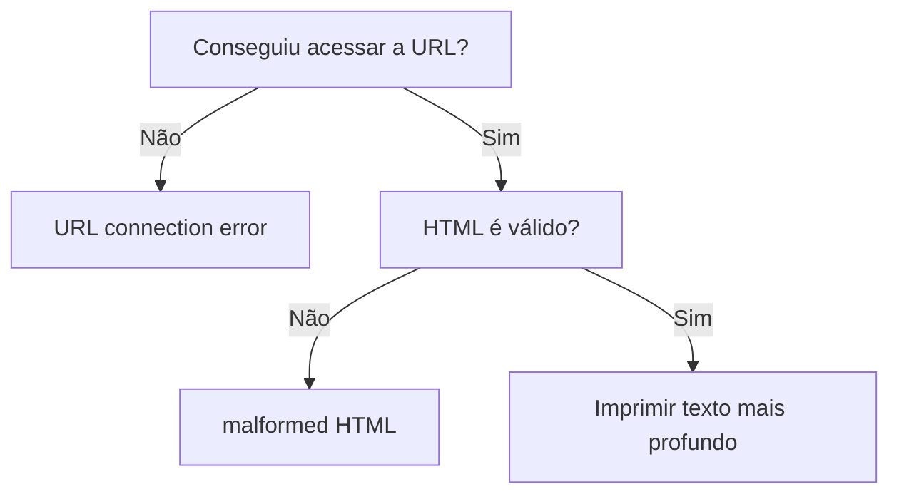

> **AXUR** - Teste técnico: Software Development Intern (02/2026).

# HTML Analyzer

## Conteúdo

 - [`Entendendo o problema (desafio)`](#und-challenge)
 - [`Entendendo o conceito de profundidade no HTML`](#und-depth-concept)
 - [`Entendendo a regra de desempate: o primeiro texto vence`](#und-rule)
 - [`Entendendo os outputs possíveis do programa`](#und-output)
 - [`Simulando casos de teste`](#test-cases)
 - [`Preparando os arquivos (.java) para serem enviados para o recrutador`](#preparing-the-files)
<!---
[WHITESPACE RULES]
- 50
--->


---

<div id="und-challenge"></div>

## `Entendendo o problema (desafio)`

> 🧠 Pense neste desafio como um jogo de camadas.

 - O HTML é como uma cebola 🧅
 - quanto mais camadas você atravessa, **mais profundo você está**.

O objetivo do programa é:

 - Encontrar o texto que está mais “enterrado” dentro dessas camadas;
 - e retornar somente esse texto no console;
 - *Nada mais!*

> **Mas, o que significa “nível de profundidade”?**

 - Cada vez que uma **tag abre**, você desce um nível.
 - Cada vez que uma **tag fecha**, você sobe um nível.

> **NOTE:**  
> O texto “herda” o nível onde ele aparece.

**Exemplo visual simples**
```html
<div>
    <section>
        <p>
            Texto profundo
        </p>
    </section>
    Texto raso
</div>
```

**Visualmente, isso vira:**
```bash
div (1)
├── section (2)
│   └── p (3)
│       └── "Texto profundo"  ← nível 3
└── "Texto raso"              ← nível 1
```

Aqui, mesmo existindo dois textos:

 - `"Texto raso"` → Tem profundidade 1
 - `"Texto profundo"` → Tem profundidade 3

✅ **Resultado final esperado:**
```bash
Texto profundo
```

> **NOTE:**  
> O programa **ignora completamente** o texto raso.


---

<div id="und-depth-concept"></div>

## `Entendendo o conceito de profundidade no HTML`

> 📐 *Profundidade é apenas um número.*  
> Esse número representa **quantas tags estão abertas naquele momento**.

Nada mais:

 - Não envolve indentação;
 - Não envolve posição visual;
 - Não envolve “nível lógico”.

> **NOTE:**  
> 👉 *Só importa quantas tags foram abertas e ainda não fechadas.*

### `O que significa “quantidade de tags abertas”?`

Sempre que o programa encontra:

 - Uma **tag de abertura** → a profundidade **aumenta**;
 - Uma **tag de fechamento** → a profundidade **diminui**;
 - Um **texto** → ele “herda” a profundidade atual.

> **📌 Texto "não altera" a profundidade.**  
> Texto apenas observa o estado atual.

### `Exemplo visual básico`

**HTML de entrada:**
```html
<div>
    <p>
        Texto
    </p>
</div>
```

Leitura mental linha a linha:

| Linha    | Tags abertas | Profundidade |
| -------- | ------------ | ------------ |
| `<div>`  | div          | 1            |
| `<p>`    | div, p       | 2            |
| `Texto`  | div, p       | 2            |
| `</p>`   | div          | 1            |
| `</div>` | —            | 0            |

> **📌 O texto está em *profundidade 2***  
> Porque existem **duas tags abertas** no momento.

### `Profundidade NÃO é indentação`

**Este HTML:**
```html
<div>
<p>
Texto
</p>
</div>
```

**E este HTML:**
```html
<div>
        <p>
Texto
        </p>
</div>
```

Têm **exatamente a mesma profundidade**, porque:

 - Indentação é ignorada
 - Apenas as tags contam


---

<div id="und-rule"></div>

## `Entendendo a regra de desempate: o primeiro texto vence`

Quando dois textos estão no mesmo nível de profundidade, não existe nova decisão:

> **🏁 O primeiro texto encontrado é o vencedor definitivo**.  
> O programa *não reconsidera*, *não compara de novo* e *não troca*.

### `Quando essa regra entra em ação?`

A regra de desempate só é aplicada quando:

 - Dois ou mais textos têm exatamente a mesma profundidade máxima;
 - Ela **nunca** se aplica quando um texto é mais profundo que outro.

### `Exemplo visual simples`

**HTML de entrada:**
```html
<div>
    <p>
        Texto A
    </p>
    <span>
        Texto B
    </span>
</div>
```

**Visualização da estrutura:**
```bash
div (1)
├── p (2)
│   └── "Texto A"
└── span (2)
    └── "Texto B"
```

> **NOTE:**  
> 📌 Ambos estão na **profundidade 2**.


**Resultado final:**
```bash
Texto A
```

### `O que o programa NÃO deve fazer`

 - ❌ Não deve substituir o texto atual em caso de empate
 - ❌ Não deve armazenar vários textos
 - ❌ Não deve escolher o último
 - ❌ Não deve ordenar ou comparar conteúdo

> **NOTE:**  
> A decisão é **puramente temporal**.


---

<div id="und-output">

## `Entendendo os outputs possíveis do programa`

> Neste desafio, o seu programa **só pode gerar três tipos de saída** no console padrão.

### `✅ 1. Texto (caso de sucesso)`

> É o **resultado esperado quando tudo dá certo**.

 - A URL foi acessada com sucesso
 - O HTML é válido
 - Um texto foi encontrado
 - Esse texto está no maior nível de profundidade

> **NOTE:**  
> O programa imprime **apenas o texto**, sem aspas, sem prefixos.

**Exemplo visual:**
```html
<div>
    <p>
        Texto mais profundo
    </p>
</div>
```

**OUTPUT:**
```bash
Texto mais profundo
```

 - Uma única linha.
 - Nenhum outro caractere.

### `❌ 2. malformed HTML`

> Esse output indica que **a estrutura do HTML é inválida**.

Ele deve ser impresso quando, por exemplo:

 - Uma tag é fechada sem ter sido aberta;
 - Tags são fechadas fora de ordem;
 - Uma ou mais tags ficam abertas no final do arquivo.

**O texto deve ser exatamente:**
```bash
malformed HTML
```

**Exemplo visual:**
```html
<div>
    <p>
</div>
```

**OUTPUT:**
```bash
malformed HTML
```

 - Mesmo que exista texto válido antes;
 - O erro estrutural tem garantia de prioridade.

### `🌐 3. URL connection error`

> Esse output indica que o programa **não conseguiu obter o HTML**.

Causas comuns:

 - URL inválida;
 - Servidor fora do ar;
 - Timeout;
 - Falha de rede.

**O texto deve ser exatamente:**
```bash
URL connection error
```

**Exemplo visual:**
```bash
java HTMLDepthAnalyzer http://url-inexistente.com
```

**OUTPUT:**
```bash
URL connection error
```

 - Sem stacktrace
 - Sem mensagem extra
 - Sem detalhes técnicos

### Regra de prioridade entre os outputs

> 🧠 **Nem todo erro tem o mesmo peso.**

A prioridade é fixa e deve ser respeitada:

 - 1️⃣ URL connection error
 - 2️⃣ malformed HTML
 - 3️⃣ Texto (sucesso)

Ou seja:

 - Se não conseguiu acessar a URL → **pare tudo**
 - Se o HTML é inválido → **ignore qualquer texto**
 - Só imprime texto se **nenhum erro ocorreu**

### `Exemplo visual de decisão`




---

<div id="test-cases"></div>

## `Simulando casos de teste`

Para simular nossos casos de testes vamos utilizar um servidor simples local com Python:

```bash
cd tests/HTML
```

> **NOTE:**  
> Dentro da pasta `tests/HTML` nós temos vários arquivos HTML específicos para cada caso de teste.

**VOCÊ DEVE ESTÁ NO DIRETÓRIO DOS HTMLs ANTES DE SUBIR O SERVIDOR LOCAL:**
```bash
python3 -m http.server 8000
```

### `✅ TESTE 1 — HTML válido com texto profundo`

[valid_deep_text.html](tests/valid_deep_text.html)
```html
<html>
    <body>
        <div>
            <section>
                <p>
                    Texto mais profundo
                </p>
            </section>
        </div>
    </body>
</html>
```

▶️ **Executar**
```bash
# Gradle
gradle run --args="http://localhost:8000/valid_deep_text.html"

# Java
java HtmlAnalyzer http://localhost:8000/valid_deep_text.html
```

✅ **Saída esperada**
```bash
Texto mais profundo
```

### `❌ TESTE 2 — URL válida, HTML válido, mas sem texto`

[valid_no_text.html](tests/valid_no_text.html)
```html
<html>
    <body>
        <div></div>
        <section></section>
    </body>
</html>
```

▶️ **Executar**
```bash
# Gradle
gradle run --args="http://localhost:8000/valid_no_text.html"

# Java
java HtmlAnalyzer http://localhost:8000/valid_no_text.html
```

✅ **Saída esperada**
```bash
no text found
```

### `❌ TESTE 3 — HTML malformado (tag fechada fora de ordem)`

[malformed_wrong_order.html](tests/malformed_wrong_order.html)
```html
<html>
    <body>
        <div>
            <p>Texto</div>
        </p>
    </body>
</html>
```

▶️ **Executar**
```bash
# Gradle
gradle run --args="http://localhost:8000/malformed_wrong_order.html"

# Java
java HtmlAnalyzer http://localhost:8000/malformed_wrong_order.html
```

✅ **Saída esperada**
```bash
malformed HTML
```

### `❌ TESTE 4 — HTML malformado (fechamento extra)`

[malformed_extra_close.html](tests/malformed_extra_close.html)
```html
<html>
    <body>
        </div>
    </body>
</html>
```

▶️ **Executar**
```bash
# Gradle
gradle run --args="http://localhost:8000/malformed_extra_close.html"

# Java
java HtmlAnalyzer http://localhost:8000/malformed_extra_close.html
```

✅ **Saída esperada**
```bash
malformed HTML
```

### `❌ TESTE 5 — HTML malformado (tag não fechada)`

[malformed_unclosed_tag.html](tests/malformed_unclosed_tag.html)
```html
<html>
    <body>
        <div>
            <p>Texto</p>
    </body>
</html>
```

▶️ **Executar**
```bash
# Gradle
gradle run --args="http://localhost:8000/malformed_unclosed_tag.html"

# Java
java HtmlAnalyzer http://localhost:8000/malformed_unclosed_tag.html
```

✅ **Saída esperada**
```bash
malformed HTML
```

### `❌ TESTE 6 — HTML válido com múltiplos textos (mais profundo ganha)`

[valid_multiple_texts.html](tests/valid_multiple_texts.html)
```html
<html>
    <body>
        Texto raso
        <div>
            Texto médio
            <section>
                Texto profundo
            </section>
        </div>
    </body>
</html>
```

▶️ **Executar**
```bash
# Gradle
gradle run --args="http://localhost:8000/valid_multiple_texts.html"

# Java
java HtmlAnalyzer http://localhost:8000/valid_multiple_texts.html
```

✅ **Saída esperada**
```bash
Texto profundo
```

### `❌ TESTE 7 — HTML válido com texto fora de tags`

[valid_text_outside_tags.html](tests/valid_text_outside_tags.html)
```html
Texto fora
<html>
    <body>
        <div>
            <p>Texto dentro</p>
        </div>
    </body>
</html>
```

▶️ **Executar**
```bash
# Gradle
gradle run --args="http://localhost:8000/valid_text_outside_tags.html"

# Java
java HtmlAnalyzer http://localhost:8000/valid_text_outside_tags.html
```

✅ **Saída esperada**
```bash
Texto dentro
```

## `❌ TESTE 8 — HTML com espaços e linhas vazias`

[valid_whitespace.html](tests/valid_whitespace.html)
```html

<html>

    <body>

        <div>

            <p>

                Texto com espaços

            </p>

        </div>

    </body>

</html>
```

▶️ **Executar**
```bash
# Gradle
gradle run --args="http://localhost:8000/valid_whitespace.html"

# Java
java HtmlAnalyzer http://localhost:8000/valid_whitespace.html
```

✅ **Saída esperada**
```bash
Texto com espaços
```

## `❌ TESTE 9 — Conteúdo não HTML (simula erro semântico)`

[not_html.txt](tests/not_html.txt)
```txt
Isso não é HTML
Apenas texto
Sem tags
```

▶️ **Executar**
```bash
# Gradle
gradle run --args="http://localhost:8000/not_html.txt"

# Java
java HtmlAnalyzer http://localhost:8000/not_html.txt
```

✅ **Saída esperada**
```bash
malformed HTML
```

## `❌ TESTE 10 — Arquivo vazio`

[empty.html](tests/empty.html)
```html

```

▶️ **Executar**
```bash
# Gradle
gradle run --args="http://localhost:8000/empty.html"

# Java
java HtmlAnalyzer http://localhost:8000/empty.html
```

✅ **Saída esperada**
```bash
no text found
```


---

<div id="preparing-the-files"></div>

## `Preparando os arquivos (.java) para serem enviados para o recrutador`

Antes de enviar os arquivos (.java) para o time da `AXUR` foi movido cópias dos arquivos [DeepestTextTracker.java](app/src/main/java/org/example/DeepestTextTracker.java), [ExecutionResult.java](app/src/main/java/org/example/ExecutionResult.java), [HtmlAnalyzer.java](app/src/main/java/org/example/HtmlAnalyzer.java), [HtmlParserState.java](app/src/main/java/org/example/HtmlParserState.java), [HtmlReader.java](app/src/main/java/org/example/HtmlReader.java) para o diretório [tests/Java/](tests/Java/).

Logo, em seguida foi removido os caminhos de pacotes `package org.example;` para evitar erros de complicação em um ambiente diferente do nosso.

Depois, nós empacotamos todos os arquivos em um arquivo `.tar` que foi renomeado de `rodrigo_leite_da_silva.tar`:

```bash
tar -cvf rodrigo_leite_da_silva.tar *.java README.md
```

> **NOTE:**  
> Um [README.md](tests/Java/README.md) introdutório também foi inserido no `.tar` para facilitar a compreensão dos avaliadores.

### `Como os avaliadores podem usar podem extrair e compilar os códigos?`

Uma abordagem seria mover o arquivo `rodrigo_leite_da_silva.tar` para o diretório `/tmp`:

```bash
cp rodrigo_leite_da_silva.tar /tmp
```

```bash
cd /tmp
```

Agora é só extrair os arquivos `.java` e compilar:

```bash
tar -xvf rodrigo_leite_da_silva.tar
```

```bash
javac HtmlAnalyzer.java
```

> **Como testar?**

Simples, basta executar o programa:

```bash
java HtmlAnalyzer http://hiring.axreng.com/internship/example1.html
```

> **NOTE:**  
> Aqui nós estamos utilizando a prórpia URL do exercício.

---

**Rodrigo** **L**eite da **S**ilva - **rodirgols89**
